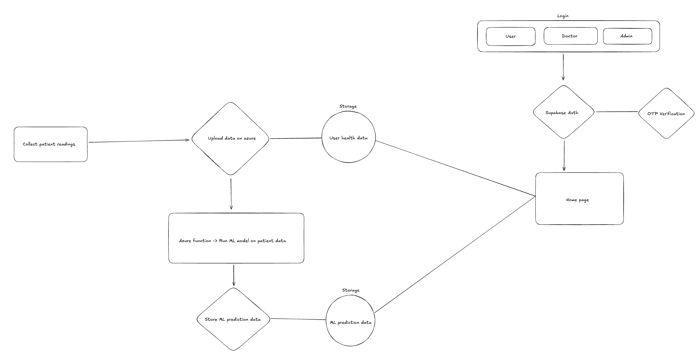
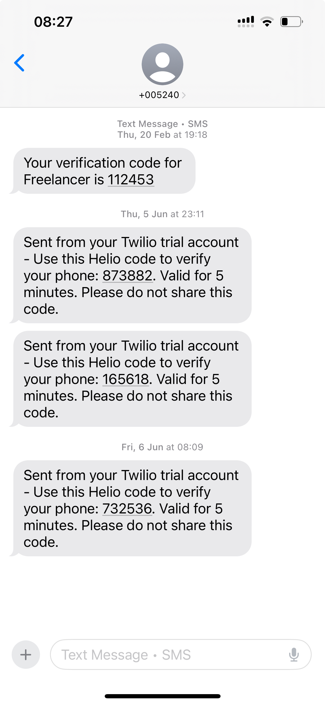

# AeroStream — Intelligent Disease Detection via Breath Analysis

AeroStream is a cloud-native platform for real-time breath analysis and disease detection, built with Next.js, Azure, Supabase, and LLMs. Designed for rural scalability, it supports secure patient-doctor workflows with OTP-based access.

---

## 1. How It Works

1. User logs in via phone number (Supabase + Twilio OTP)
2. Breath input is collected and processed client-side
3. Processed signal sent to Azure Function → triggers LLM-based prompt analysis
4. Disease risk is inferred and shown on the User Dashboard
5. Notification sent to doctor dashboard if threshold is crossed

---

## 2. Features

- **Breath-Based Disease Prediction** using signal data and AI prompt engineering
- **Secure Auth with Supabase** and **SMS OTP with Twilio**
- **Mobile-First Frontend** built with Next.js and Shadcn for rapid access
- **Azure Cloud-Hosted Backend** for inference and data sync
- **Doctor Dashboard** for tracking patient diagnostics
- **Admin Panel** for managing trends, usage, and rural deployment

---

## 3. Motivation

> AeroStream is designed to bring **preventive health diagnostics** to underserved regions through low-cost, LLM-powered tools that operate on breath-based bio-signals. Breath contains detectable biomarkers for diseases such as **COVID-19, diabetes, lung disease, and even cancer**.

---

## 4. Status

| Feature               | Description                                           | Status      |
| --------------------- | ----------------------------------------------------- | ----------- |
| Londing Page          | landing page, packages, getting started               | Done        |
| Supabase setup        | Authentication, New user data                         | Done        |
| Login Page            | User authentication UI                                | Done        |
| Singup Page           | User registration                                     | Done        |
| OTP Verification      | User verification on phone number                     | Done        |
| Azure                 | Blob, Azure functions                                 | Done        |
| User Dashboard        | Displays user data                                    | In Progress |
| Doctor Dashboard      | User authentication UI                                | In Progress |
| Disease Notifications | Alert User of detected Disease, send report to doctor | Not Started |

---

# 5. Architecture



# 6. Landing Page


```md

```

## 7. Tech Stack

| Layer      | Tools                                      |
| ---------- | ------------------------------------------ |
| Frontend   | Next.js, Shadcn, Tailwind, TypeScript      |
| Backend    | Azure Functions, Blob, Supabase (Auth, DB) |
| Auth & OTP | Supabase + Twilio SMS                      |
| Auth & OTP | Supabase + Twilio SMS                      |

---

## 8. Getting Started

```md
git clone https://github.com/rahulyyadav/AeroStream.git
cd aerostream
```

### Install frontend

```md
cd frontend && npm install
```

### Environment setup

```md
cp .env.example .env.local
```

> Add Supabase + Twilio keys here

### Start frontend

```md
npm run dev
```
