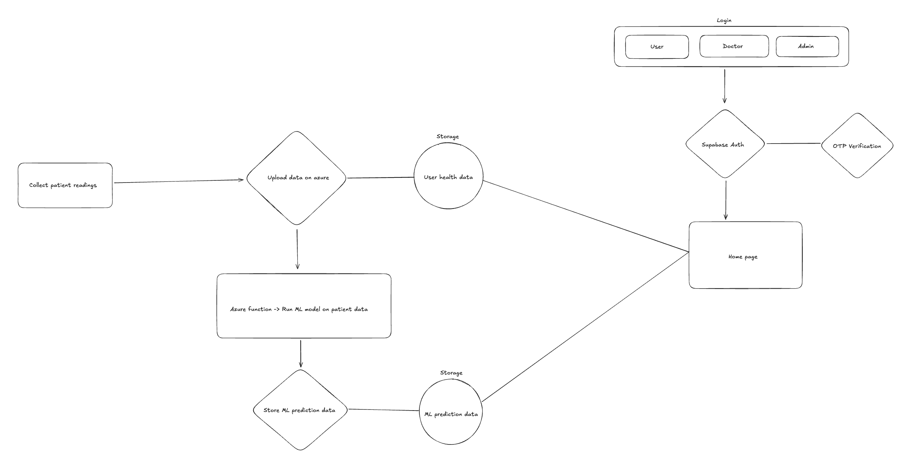
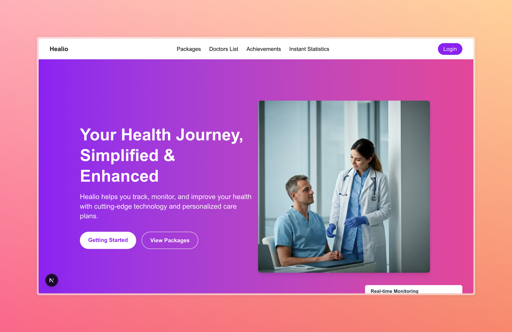

# 🧠 AeroStream — Intelligent Disease Detection via Breath Analysis

AeroStream is an AI-driven, cloud-based platform that enables early-stage disease detection through **breath analysis**, empowering rural and urban healthcare systems alike. Built using **Next.js**, **Azure**, and **Supabase**, the platform uses **LLMs for inference**, **Twilio for OTP verification**, and supports both patients and doctors through a mobile-friendly interface.

---

## 🚀 Features

- 🩺 **Breath-Based Disease Prediction** using signal data and AI prompt engineering
- 🔐 **Secure Auth with Supabase** and **SMS OTP with Twilio**
- 📱 **Mobile-First Frontend** built with Next.js and Shadcn for rapid access
- 🌩️ **Azure Cloud-Hosted Backend** for inference and data sync
- 🧑‍⚕️ **Doctor Dashboard** for tracking patient diagnostics
- 🏥 **Admin Panel** for managing trends, usage, and rural deployment

---

## 🧪 Motivation

> AeroStream is designed to bring **preventive health diagnostics** to underserved regions through low-cost, LLM-powered tools that operate on breath-based bio-signals. Breath contains detectable biomarkers for diseases such as **COVID-19, diabetes, lung disease, and even cancer**.

---



```md

```

```md

```

## 🧰 Tech Stack

Layer Tools
Frontend Next.js, Shadcn, Tailwind, TypeScript
Backend Azure Functions, Blob, Supabase (Auth, DB)
Auth & OTP Supabase + Twilio SMS
Deployment Vercel (frontend), Azure (backend inference)

## 🛠️ Getting Started

git clone https://github.com/rahulyyadav/AeroStream.git
cd aerostream

# Install frontend

cd frontend && npm install

# Environment setup

cp .env.example .env.local

# Add Supabase + Twilio keys here

# Start frontend

npm run dev
